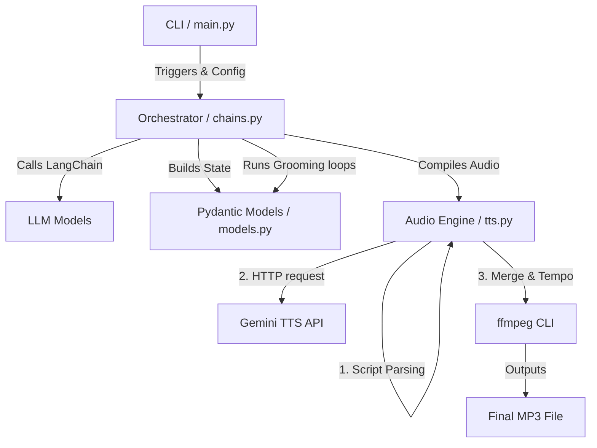
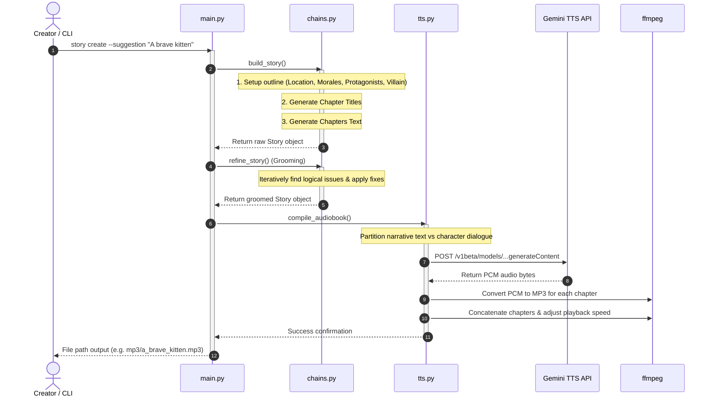

# Project Wiki

## 1. Product Overview
The **Children Story Generator** is an automated content creation and publishing pipeline. It is designed to generate highly engaging, multi-chapter children's stories based on a simple prompt suggestion, refine the narratives to resolve any logical inconsistencies, and compile them into high-quality audiobooks (audio files) using customized, multi-speaker voice synthesis. 

By leveraging Generative AI (LLMs) and advanced Speech Synthesis (TTS), the system automates what is typically a time-consuming manual workflow, creating ready-to-listen audiobooks complete with distinct character voices, narrator tones, and optimized audio pacing.

---

## 2. Who Uses It / Key Actors
* **Content Creators & Educators**: Use the tool to quickly draft custom stories with tailored educational themes, target reading speeds, and specific moral lessons.
* **Publishers / Operators**: Run automated pipelines to mass-produce storytelling content for children's audio platforms or podcasts.
* **Developers / Integrators**: Extend the generation parameters, refine LLM prompt rules, or integrate new speech synthesis providers.

---

## 3. Core Product Capabilities & Entities

### Product Capabilities

| Capability | What it does | Why it matters | Key locations |
| --- | --- | --- | --- |
| **Story Idea Generation** | Automatically suggests high-interest, creative, and humorous concepts suitable for children. | Solves the "blank page" problem for content creators. | [main.py](file:///home/andrejs/www/storygen-py/storygen/main.py#L66-L72), [chains.py](file:///home/andrejs/www/storygen-py/storygen/chains.py#L27-L34) |
| **Interactive Outlining & Writing** | Progressively establishes a story plan, setting, protagonists, moral themes, and chapters before generating the detailed text. | Ensures story structure is cohesive, thematic, and paced correctly. | [chains.py](file:///home/andrejs/www/storygen-py/storygen/chains.py#L36-L173), [prompts.py](file:///home/andrejs/www/storygen-py/storygen/prompts.py) |
| **Automated Editing (Grooming)** | Runs pre-reading cycles to inspect generated story chapters for plot holes, contradictions, and logical flaws, then adjusts the text. | Guarantees quality and structural integrity without manual editing. | [chains.py](file:///home/andrejs/www/storygen-py/storygen/chains.py#L175-L267), [prompts.py](file:///home/andrejs/www/storygen-py/storygen/prompts.py#L55-L137) |
| **Speech Synthesis (TTS)** | Parses the generated narrative and spoken dialogue to synthesize audio with multi-speaker support. | Enhances immersion by matching distinct character genders/roles with specific voices. | [tts.py](file:///home/andrejs/www/storygen-py/storygen/tts.py), [config.py](file:///home/andrejs/www/storygen-py/storygen/config.py#L4-L10) |
| **Audiobook Compilation** | Merges chapter-specific audio clips into a final MP3 file and scales the playback speed. | Delivers a single, polished output file optimized for children's listening speeds. | [tts.py](file:///home/andrejs/www/storygen-py/storygen/tts.py#L103-L140), [utils.py](file:///home/andrejs/www/storygen-py/storygen/utils.py#L13-L26) |

### Key Entities
The core entity in the system is the [Story](file:///home/andrejs/www/storygen-py/storygen/models.py#L39-L53) object, which encapsulates the entire state of the generated audiobook:

* **Story Metadata**:
  * `story_prompt`: The original suggestion or theme that triggered the story.
  * `title`: A title (typically 3 to 5 words long).
  * `summary`: A single-sentence summary of the story.
  * `plan`: A high-level, flexible outline mapping out what happens without constraining the writer's details.
  * `location`: A specific, kid-friendly world description (e.g., matching the duration constraints).
  * `structure`: The overarching plot structure, defaulting to a three-act setup (Setup, Primary action, Resolution).
  * `time_period`: The setting description (defaults to "Once upon a time").
  * `length`: A text summary of word counts, chapter counts, and speech speeds.
* **Morales**: A list of moral themes (such as "Kindness and Compassion") selected for the story to ensure educational value.
* **Protagonists**: A list of key characters containing:
  * `name`: Memorable name.
  * `voice`: Highly descriptive, specific, and creative voice traits (e.g., "Deep grumpy and sad old male voice", "Overly excited and jumpy female kid voice", "Raspy and mysterious whisper") to instruct narrator speech and guide casting. Vague attributes like "high", "medium", or "low" are explicitly rejected.
  * `type`: Character species (e.g., human, animal, magical).
  * `gender` and `age`: Demographics used to determine default speech pitch.
* **Villain**: The main opposing force (which can also be elements of nature or objects), including a short description and a specific `villain_voice`.
* **Chapters**: A list of [Chapter](file:///home/andrejs/www/storygen-py/storygen/models.py#L4-L7) items containing `number`, `title`, and the generated narrative `text`.

---

## 4. How the System Is Organized (System Interactions)
The application follows a modular architecture where the command line boundary ([main.py](file:///home/andrejs/www/storygen-py/storygen/main.py)) feeds user configuration into the Orchestration layer ([chains.py](file:///home/andrejs/www/storygen-py/storygen/chains.py)). 



### Direct and Indirect Interactions:
1. **Config Modification to Word Budgets**: Modifying CLI parameters such as `length_in_min` or `speech_speed` recalculates the target word count per chapter in [utils.py](file:///home/andrejs/www/storygen-py/storygen/utils.py#L13-L26). This directly bounds the prompt limits passed into the LLM during text generation.
2. **Character Definitions to TTS Configuration**: The gender and description of protagonists defined during outlining in [chains.py](file:///home/andrejs/www/storygen-py/storygen/chains.py#L71-L83) map directly to male or female pre-built TTS voice profiles in [tts.py](file:///home/andrejs/www/storygen-py/storygen/tts.py#L16-L24).
3. **Regex Splitting & Voice Markup**: The writing instructions in [prompts.py](file:///home/andrejs/www/storygen-py/storygen/prompts.py#L44-L46) require speaker names to always precede dialogue. This creates a clean boundary for the regex in [tts.py](file:///home/andrejs/www/storygen-py/storygen/tts.py#L11-L14) to parse character quotes out of a single text stream and compile a multi-speaker configuration.
4. **Dialogue Matching and Cast Casting**: The `DIALOGUE_PATTERN` regular expression matches direct speech structures such as `Speaker said "dialogue text"`. If the speaker name matches a defined protagonist name or villain name, that segment of dialogue is tagged to use the corresponding voice config. If it doesn't match, it is attributed to the Narrator voice.

---

## 5. Key Workflows / User Journeys

### Workflow A: Generate, Edit, and Synthesize Audiobook (`create` command)
This is the primary end-to-end journey that takes a topic suggestion and compiles a final MP3 file:



* **Triggers**: CLI command `story create` with a suggestion string.
* **State Changes**: Creates a story config, builds draft chapter text, rewrites chapters dynamically to resolve issues, and saves JSON states to disk (e.g., `story.title.json` and `final_groomed_story.title.json`).
* **Failure Paths**: 
  * If the LLM returns invalid JSON outlines, the parser fails, fallback defaults (like time periods) are applied.
  * If the TTS API fails or credentials are empty, the CLI errors during audio generation.

---

## 6. Specific Business Logic, Constraints, and Edge Cases

### Word Count Budgets
To match a target audio length, the system dynamically divides the story's length into target word budgets in [utils.py](file:///home/andrejs/www/storygen-py/storygen/utils.py#L13-L26):
* **Target duration**: Derived from the target minutes multiplied by the effective reading speed (default 132 WPM) scaled by the playback speed (`speech_speed`).
* **Multi-Chapter Distribution**: The first chapter is given a slightly shorter target (80% of max word budget) to serve as a hook, the last chapter is capped at 60% to resolve story threads swiftly, and intermediate chapters receive 100%.
* **Single-Chapter Stories**: If the chapter count is set to 1, the single chapter is allocated 100% of the calculated word budget directly without any scaling reductions ([utils.py](file:///home/andrejs/www/storygen-py/storygen/utils.py#L30-L32)).

### Text Formatting, Cleaning, & Repetition Prevention
Before text is sent to the TTS engines, emojis and markdown formatting are cleaned, and repetition is prevented:
* Standard markdown formatting characters like asterisks (`*`) and hash signs (`#`) are stripped in the `build_content` method to ensure the text engine reads naturally.
* Emojis are aggressively removed using regex patterns in [utils.py](file:///home/andrejs/www/storygen-py/storygen/utils.py#L61-L66) to avoid synthesizing speech artifacts or causing failures in text formatting.
* **Chapter Title/Number Exclusion in Generation**: To prevent the model from generating repeating headers, both `WRITE_CHAPTER_PROMPT` (or `FIGURE_CHAPTER_PROMPT`) and `ADJUST_CHAPTER_PROMPT` explicitly instruct the LLM to omit chapter titles or numbers and start text directly with the story narrative.
* **Duplicate Story Title Avoidance**: During final text compilation in `build_content` inside [models.py](file:///home/andrejs/www/storygen-py/storygen/models.py#L54-L75), if the chapter's title is exactly identical to the overall story title (common in single-chapter stories), the system omits repeating the title and formats the header simply as "Chapter X." instead of "Chapter X.\nTitle".

### Grooming Loop Strictness
The grooming system in [chains.py](file:///home/andrejs/www/storygen-py/storygen/chains.py#L175-L267) allows multiple loops (controlled by `preread_loops`, defaulting to 2). To prevent infinite loops or excessive editing, the system instructs the LLM to lower its analysis strictness proportionally with every loop.

---

## 7. Integrations & External System Restrictions

### 1. OpenCode Zen LLM Gateway
* **Use Case**: Powers all LangChain prompt chains to outline, write, and groom story text.
* **Endpoint**: `https://opencode.ai/zen/go/v1` (configured via `LLM_BASE_URL`).
* **Model**: Defaults to `deepseek-v4-flash` or `zai-glm-4.6`.
* **Reliability/Risks**: Structured JSON parsing relies heavily on the model supporting clean raw JSON output. A parsing failure during grooming falls back to skipping the remaining refinement loops.

### 2. Google Gemini Speech API (TTS)
* **Use Case**: Synthesizes natural speech from generated story scripts.
* **Endpoint**: `https://generativelanguage.googleapis.com/v1beta/models` (configured via `TTS_BASE_URL`).
* **Model**: `gemini-3.1-flash-tts-preview` (configured via `TTS_MODEL`).
* **Authentication**: Requires a valid `x-goog-api-key` in the header (loaded via `GOOGLE_API_KEY`).
* **Input Schema Constraints**: Accepts custom `multiSpeakerVoiceConfig` payloads, specifying speech configurations mapped directly to pre-defined speaker voices.
* **Audio Format**: Returns PCM audio encoded as a base64 string, which must be decoded and converted on the host machine. The audio stream is returned as 16-bit little-endian PCM (`s16le`), single channel (`ac 1`), at a 24000 Hz (`ar 24000`) sample rate.

### 3. ffmpeg CLI
* **Use Case**: Merges chapter MP3 tracks and applies speed adjustments.
* **Requirements**: Must be pre-installed on the host system path.
* **Risks/Details**: Uses a file concatenation list (`concat.txt`) in the temporary folder. If file access is restricted, the final concatenation command will fail.
  * For converting raw PCM audio:
    ```bash
    ffmpeg -y -f s16le -ar 24000 -ac 1 -i <pcm_file> -c:a libmp3lame -q:a 0 <output_path>
    ```
  * For joining chapter files and adjusting the speed:
    ```bash
    ffmpeg -y -f concat -safe 0 -i concat.txt -filter:a "atempo=<speech_speed>" -c:a libmp3lame -q:a 0 <final_path>
    ```
  * When `speech_speed` is 1.0, it uses direct stream copy `-c copy` to merge files without re-encoding, ensuring maximum performance and zero quality loss.

---

## 8. Configuration / Runtime / Operations

### Environment Configuration
The runtime parameters are loaded from [storygen.env](file:///home/andrejs/www/storygen-py/storygen.env) at the root of the project using Pydantic Settings:

```ini
LLM_API_KEY=sk-XyDxX...
GOOGLE_API_KEY=AIzaSy...
LLM_BASE_URL=https://opencode.ai/zen/go/v1
MODEL_NAME=deepseek-v4-flash
```

### Essential CLI Operations
Here are the commands commonly used during local execution:

```bash
# List all prebuilt voices supported by Gemini TTS
python -m storygen.main story voices

# Generate a complete audiobook (text + audio MP3)
python -m storygen.main story create "A tiny frog who wanted to fly"

# Draft a story as JSON text without converting it to speech
python -m storygen.main story write "A sleepy dragon in a quiet volcano"

# Convert an existing story JSON file to audio
python -m storygen.main story voice tmp/final_groomed_A_tiny_frog.json
```

---

## 9. Code Map for Engineers
* **CLI Routing**: [main.py](file:///home/andrejs/www/storygen-py/storygen/main.py) — Defines Typer commands, Callback validation, and CLI stdout tables.
* **Configuration**: [config.py](file:///home/andrejs/www/storygen-py/storygen/config.py) — Handles Pydantic settings parsing, env-file matching, and enum setups.
* **Data Schema**: [models.py](file:///home/andrejs/www/storygen-py/storygen/models.py) — Pydantic entities, serialization logic, and formatting utilities.
* **Orchestration**: [chains.py](file:///home/andrejs/www/storygen-py/storygen/chains.py) — Outline generations, chapter writers, loop controls, and comparison logic.
* **Prompts**: [prompts.py](file:///home/andrejs/www/storygen-py/storygen/prompts.py) — Text styling guidelines, force-JSON options, and logical flaw checkers.
* **TTS Engine**: [tts.py](file:///home/andrejs/www/storygen-py/storygen/tts.py) — Regex dialogue splitters, Multi-speaker setups, PCM builders, and ffmpeg calls.
* **Utilities**: [utils.py](file:///home/andrejs/www/storygen-py/storygen/utils.py) — Target words calculators, emoji sanitizers, and file system readers/writers.
* **Test Utilities**: [test_llm.py](file:///home/andrejs/www/storygen-py/test_llm.py) — Tests LLM structured output compatibility (json_mode vs function calling). [test_typer.py](file:///home/andrejs/www/storygen-py/test_typer.py) — Validates command-line option defaults and syntax.

---

## 10. Known Gaps / Open Questions
* **Voice Mapping in TTS**: Although protagonists are now generated with highly descriptive voice attributes (e.g., 'Squeaky, energetic, and slightly breathless young boy'), the TTS engine in [tts.py](file:///home/andrejs/www/storygen-py/storygen/tts.py#L16-L24) still performs a basic binary gender-to-voice mapping (mapping male/boy to `voice_male` and others to `voice_female`). The detailed voice trait description is not yet parsed dynamically to configure custom speech synthesis profiles.
* **API Rate Limiting**: There is currently no retry mechanism or back-off logic in [tts.py](file:///home/andrejs/www/storygen-py/storygen/tts.py#L79) if the Google Gemini TTS endpoint returns a `429 Too Many Requests` or `503 Service Unavailable` response.
* **Temporary File Cleanup on Failure**: If `ffmpeg` encounters an error during compilation, the temporary `.mp3` chapter files are not automatically cleaned up from the temporary directory (`tmp/`).
